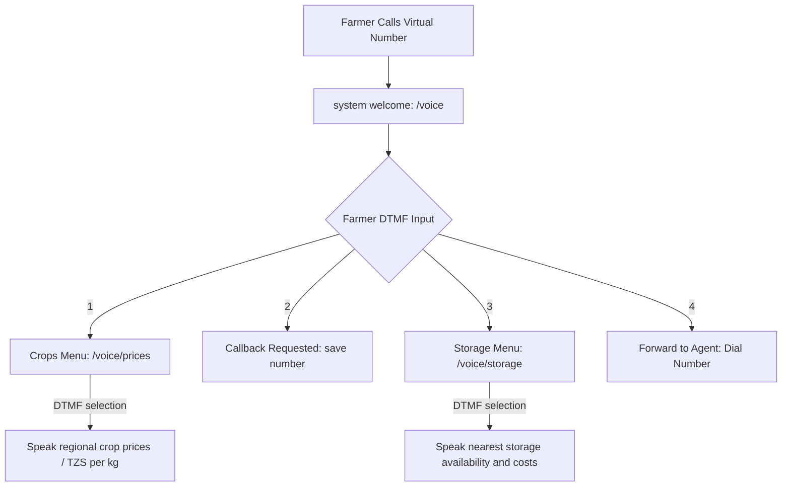

# Africa's Talking Voice Webhook Setup Guide

This guide describes how to configure and integrate the Africa's Talking Voice API to connect offline farmers and 2G feature phone users to the AgriMove-AI interactive voice response (IVR) system.

## Setup Steps

### 1. Account Configuration
1. Sign up or log in to [Africa's Talking](https://africastalking.com/).
2. Create an account or switch to the **Sandbox** mode for local testing.
3. Obtain a virtual phone number from the Voice section of the dashboard.

### 2. Configure Voice Callback Webhook
To route calls through your server, Africa's Talking needs to know where to send voice requests.

1. In the Africa's Talking dashboard under the **Voice** menu, find **Callbacks**.
2. Set the **Voice Callback URL** (Webhook) to your server's endpoint:
   ```text
   http://<your-server-domain-or-ngrok>/voice
   ```
3. Set the method to `POST`.

### 3. Setup Ngrok for Local Development
Since Africa's Talking needs a public URL to send webhook requests to your local development machine:

1. Install ngrok (or any other tunnel utility):
   ```bash
   npm install -g ngrok
   # or download from ngrok.com
   ```
2. Expose your Flask server (running on port `5000` by default):
   ```bash
   ngrok http 5000
   ```
3. Copy the secure HTTPS URL provided by ngrok (e.g., `https://xxxx-xx-xx.ngrok-free.app`).
4. Paste this base URL followed by `/voice` into the Africa's Talking voice callback config.

---

## Interactive Voice Response (IVR) Schema

When a user calls your voice number, the following call routing and DTMF (keypad) state machine is triggered:



### Response Formats
The endpoints return Africa's Talking XML structure (voice response code):

#### Welcome Call Webhook (`/voice`)
```xml
<?xml version="1.0" encoding="UTF-8"?>
<Response>
    <GetDigits timeout="15" finishOnKey="#" callbackUrl="/voice/handle">
        <Say voice="woman" playBeep="false">
            Karibu AgriMove Tanzania. Msaada wa wakulima.
            Bonyeza moja kwa bei za mazao.
            Bonyeza mbili kwa kutafuta gari.
            Bonyeza tatu kwa hifadhi karibu nawe.
            Bonyeza nne kuzungumza na wakala.
            Kisha bonyeza gridi.
        </Say>
    </GetDigits>
</Response>
```

---

## Testing Using the Simulator
To test your voice integration offline without spending airtime:
1. Open the Africa's Talking **Web Simulator**.
2. Dial your sandbox virtual number.
3. You will see call event logs hitting your Flask backend console in real-time, responding with standard AT XML protocols.
