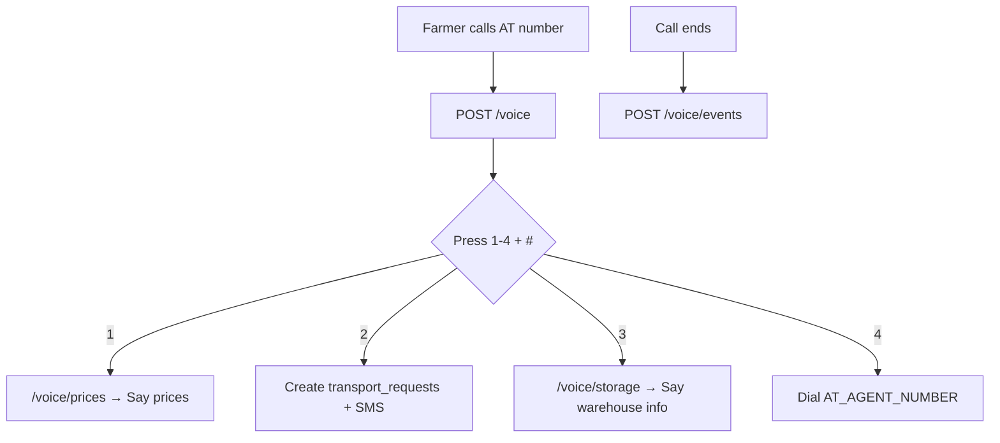

# Africa's Talking Voice Webhook Setup Guide

This guide walks you through connecting [Africa's Talking Voice](https://developers.africastalking.com/docs/voice/overview) to the AgriMove AI Swahili IVR for farmers on feature phones (no internet required).

---

## What Was Implemented

| Endpoint | Purpose |
|----------|---------|
| `POST/GET /voice` | Main IVR entry — Swahili welcome menu |
| `POST /voice/handle` | Routes menu choices 1–4 |
| `POST /voice/prices` | Speaks crop prices (mahindi, mpunga, nyanya, vitunguu) |
| `POST /voice/storage` | Speaks warehouse availability by region |
| `POST /voice/events` | Receives call lifecycle events from AT |
| `GET /api/africas-talking/status` | Shows SMS + Voice config and callback URLs |
| `GET /api/voice/logs` | Last 50 voice events (debugging) |

**Menu options when a farmer calls:**

1. **Bei za mazao** — crop prices from `market_prices` table  
2. **Kutafuta gari** — creates `transport_requests` + SMS confirmation (+ optional outbound callback)  
3. **Hifadhi** — storage info from `storage_facilities`  
4. **Wakala** — forwards call to `AT_AGENT_NUMBER`  

---

## Step 1 — Install Dependencies

```bash
cd /path/to/AgriMove-AI
python -m venv .venv
source .venv/bin/activate          # macOS/Linux
pip install -r requirements.txt
```

---

## Step 2 — Create Africa's Talking Account

1. Sign up at [africastalking.com](https://africastalking.com/).
2. Open the **Sandbox** dashboard for testing.
3. Go to **Voice** and obtain a **virtual phone number**.
4. Copy your **API Key** and **Username** (sandbox username is usually `sandbox`).

For production, create a Voice-enabled app in your AT account and request a voice product.

---

## Step 3 — Configure Environment Variables

Copy the example file and fill in your values:

```bash
cp .env.example .env
```

Edit `.env`:

```env
AT_USERNAME=sandbox
AT_API_KEY=your_sandbox_api_key_here
AT_VOICE_NUMBER=+255XXXXXXXXX
AT_AGENT_NUMBER=+255YYYYYYYYY
VOICE_BASE_URL=https://your-ngrok-url.ngrok-free.app
```

| Variable | Required | Description |
|----------|----------|-------------|
| `AT_USERNAME` | Yes | AT username (`sandbox` in sandbox) |
| `AT_API_KEY` | Yes | AT API key |
| `AT_VOICE_NUMBER` | For outbound calls | Your AT virtual number |
| `AT_AGENT_NUMBER` | Optional | Support agent for menu option 4 |
| `VOICE_BASE_URL` | **Strongly recommended** | Public HTTPS base URL (ngrok or production). Used for absolute `callbackUrl` values in VoiceXML |

The app loads `.env` automatically via `python-dotenv`.

---

## Step 4 — Start Flask

```bash
python app.py
```

Server runs at `http://127.0.0.1:5000`.

Seed demo data (market prices, storage, etc.) by visiting:

```
http://127.0.0.1:5000/setup-demo
```

Verify integration status:

```
http://127.0.0.1:5000/api/africas-talking/status
```

You should see `voice.callbacks` with full HTTPS URLs.

---

## Step 5 — Expose Local Server with ngrok

Africa's Talking must reach your machine over the public internet.

```bash
# Install ngrok from https://ngrok.com/ then:
ngrok http 5000
```

Copy the **HTTPS** URL (e.g. `https://abc123.ngrok-free.app`).

Update `.env`:

```env
VOICE_BASE_URL=https://abc123.ngrok-free.app
```

Restart Flask after changing `.env`.

---

## Step 6 — Configure Africa's Talking Dashboard

In the AT dashboard under **Voice → Callbacks** (or your app's voice settings):

| Setting | Value |
|---------|-------|
| **Voice Callback URL** (Call Instructions) | `https://abc123.ngrok-free.app/voice` |
| **HTTP Method** | `POST` |
| **Voice Events URL** (optional) | `https://abc123.ngrok-free.app/voice/events` |

Reference: [Handle calls](https://developers.africastalking.com/docs/voice/handle_calls) · [GetDigits](https://developers.africastalking.com/docs/voice/actions/get_digits)

---

## Step 7 — Test the IVR

### Option A: AT Web Simulator

1. Open the [Africa's Talking Simulator](https://simulator.africastalking.com).
2. Dial your sandbox virtual number.
3. Watch Flask terminal logs for `[Voice]` and `[Voice Event]` lines.
4. Press menu keys followed by `#` (hash).

### Option B: curl (local smoke test)

```bash
# Main menu
curl -X POST http://127.0.0.1:5000/voice \
  -d "sessionId=test-001" \
  -d "isActive=1" \
  -d "callerNumber=%2B255712345678" \
  -d "destinationNumber=%2B255700000001"

# Simulate pressing "1" then "#" on main menu
curl -X POST http://127.0.0.1:5000/voice/handle \
  -d "sessionId=test-001" \
  -d "dtmfDigits=1" \
  -d "callerNumber=%2B255712345678"

# Simulate crop price lookup (press 1 for mahindi)
curl -X POST http://127.0.0.1:5000/voice/prices \
  -d "sessionId=test-001" \
  -d "dtmfDigits=1" \
  -d "callerNumber=%2B255712345678"

# Simulate transport request (press 2 on main menu)
curl -X POST http://127.0.0.1:5000/voice/handle \
  -d "sessionId=test-002" \
  -d "dtmfDigits=2" \
  -d "callerNumber=%2B255712345678"
```

Check logs:

```
http://127.0.0.1:5000/api/voice/logs
```

---

## Step 8 — Verify End-to-End Features

| Test | Expected result |
|------|-----------------|
| Press **1 → 1 → #** | Hears maize prices for Dar/Arusha/Mbeya |
| Press **2 → #** | New row in `transport_requests`, SMS logged/sent, entry in `transport_callbacks` |
| Press **3 → 1 → #** | Hears Mbeya storage info |
| Press **4 → #** | Call forwarded to `AT_AGENT_NUMBER` (or polite unavailable message) |
| Hang up | Event logged at `/voice/events` if configured |

View transport requests in the app at `/transport`.

---

## Troubleshooting

| Problem | Fix |
|---------|-----|
| Sub-menus don't work after main menu | Set `VOICE_BASE_URL` to your full ngrok HTTPS URL and restart Flask |
| No audio / call drops | Ensure callback URL is HTTPS and returns HTTP 200 |
| SMS not sent on option 2 | Set `AT_API_KEY`; sandbox SMS only works to verified numbers |
| Outbound callback fails | Set both `AT_VOICE_NUMBER` and `AT_API_KEY`; sandbox has limits |
| Agent transfer fails | Set `AT_AGENT_NUMBER` to a valid international number |
| Prices say wrong amounts | Visit `/setup-demo` to seed `market_prices` with `price_per_kg_tzs` |
| Empty voice logs table | Table is created on startup; make a test call first |

---

## Production Checklist

- [ ] Switch from sandbox to production AT credentials  
- [ ] Deploy Flask behind HTTPS (not raw ngrok)  
- [ ] Set `VOICE_BASE_URL` to your production domain  
- [ ] Set `debug=False` in `app.py`  
- [ ] Configure both Voice Callback URL and Events URL in AT dashboard  
- [ ] Set real `AT_AGENT_NUMBER`  
- [ ] Test all four menu paths on a real phone  

---

## Architecture



**AgriMove AI — Voice access for every farmer, with or without a smartphone.**
